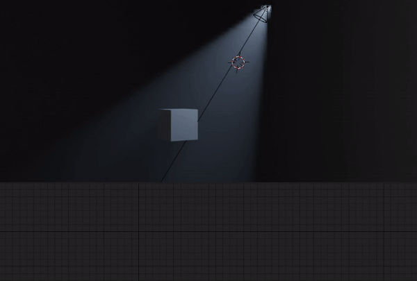
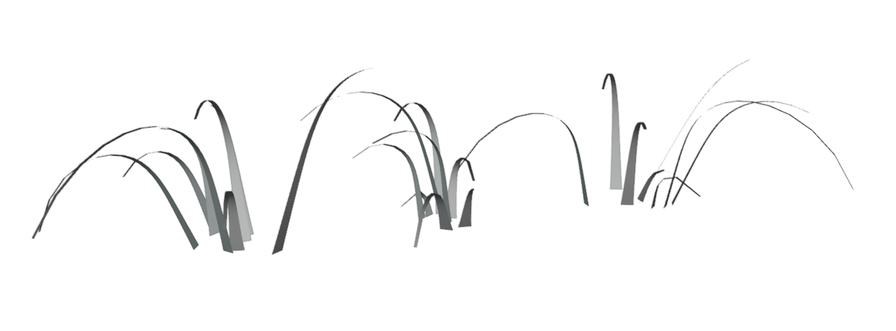

# Blender Addons
Here I will upload small Blender Addons that are not worthy if their own repository.

## Add Lightblocker [(Download)](https://raw.githubusercontent.com/SimonStorlSchulke/blender-addons/master/add_lightblocker.py)
Creates a Lightblocker Object with an material preset from the Light Context Menu.

## Add Grass Shrubs [(Download)](https://raw.githubusercontent.com/SimonStorlSchulke/blender-addons/master/add_grass_shrubs.py)
Creates a collection of customizable grass shrubs for use in particle systems.

## Hardify [(Download)](https://raw.githubusercontent.com/SimonStorlSchulke/blender-addons/master/hardify.py)
Quickly Shades an Object Smooth and turns on Autosmooth + Optional Weighted Normals Modifier. Located in Object Mode → Select Mesh Object → Object Context Menu (Rightclick or W)
